<div align="center">

# 🦖 Raptor Link

### Bring WLED into your PC RGB ecosystem.

**WLED + Corsair iCUE + direct Raptor Link effects + screen ambience + presets + automation — from one Windows app.**

[](https://github.com/Inter-Raptor/Raptor-Link)
[](https://kno.wled.ge/)
[](https://www.corsair.com/icue)
[](LICENSE)
[](https://github.com/Inter-Raptor/Raptor-Link/issues)

<br>

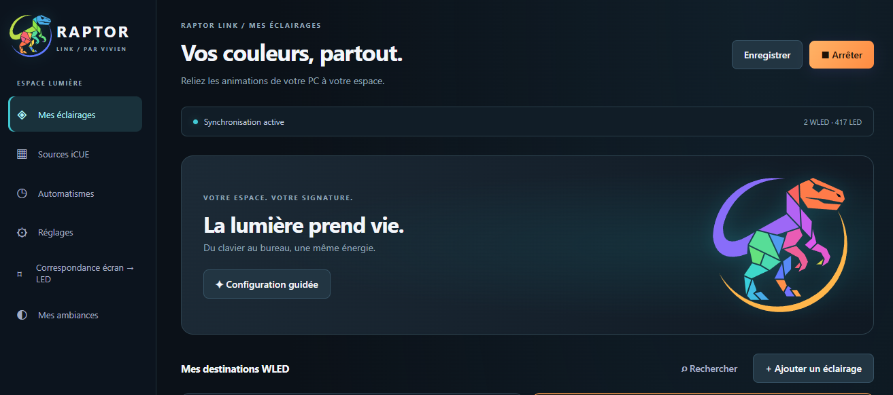

</div>

---

## What is Raptor Link?

**Raptor Link** is a Windows application built to make DIY **WLED** lighting feel like a native part of a PC setup.

Its original purpose is to bridge **WLED** devices with **Corsair iCUE**, but it is not limited to Corsair hardware. Raptor Link can also be used as a standalone WLED control and synchronization tool.

Instead of treating every LED controller as a separate web page, Raptor Link gives you one place to organize devices, link lighting to your screen, trigger WLED presets and build a more coherent RGB installation.

> **One PC. Multiple WLED controllers. One lighting ecosystem.**

---

## ⚡ Highlights

| | Feature | What it does |
|---|---|---|
| 🎮 | **Corsair iCUE integration** | Bring WLED lighting into an iCUE-centered setup |
| 🌈 | **WLED control** | Manage WLED devices directly from the application |
| 🖥️ | **Screen ambience** | Sample screen colors and send them to your LEDs |
| 🧭 | **Visual LED mapping** | Associate physical LED sections with areas of the display |
| 💡 | **Multiple WLED devices** | Control more than one WLED controller from the same app |
| 🎨 | **WLED presets** | Reuse effects and presets already created in WLED |
| ⚙️ | **Automations** | Trigger lighting behavior according to your PC setup |
| 🌐 | **Direct WLED access** | Open the native WLED web UI from Raptor Link |
| 🖱️ | **System tray support** | Keep Raptor Link available without leaving a large window open |
| 🔌 | **Works without Corsair** | iCUE is optional for users who only want WLED features |

---

## 🎬 See it in action

<div align="center">

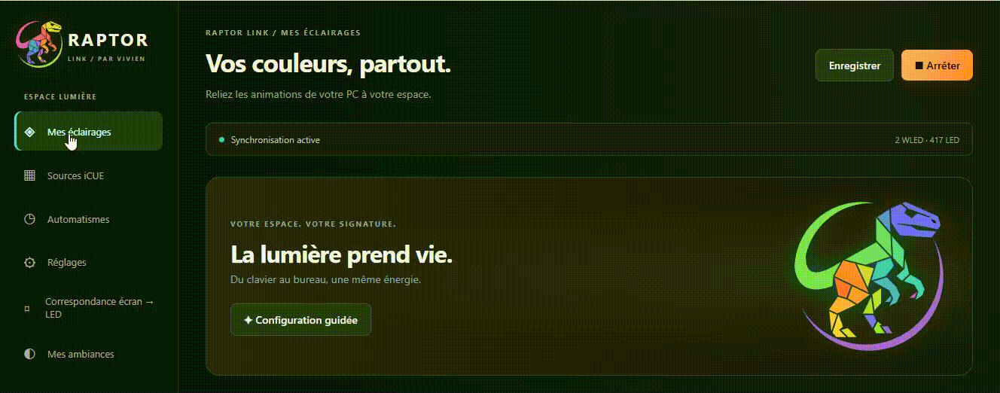

</div>

Raptor Link is designed around **real-time interaction**: change a source, preset or mapping and immediately see the result on the lighting installation.

---

## 🖥️ Application overview

<div align="center">

<table>
<tr>
<td width="50%"></td>
<td width="50%">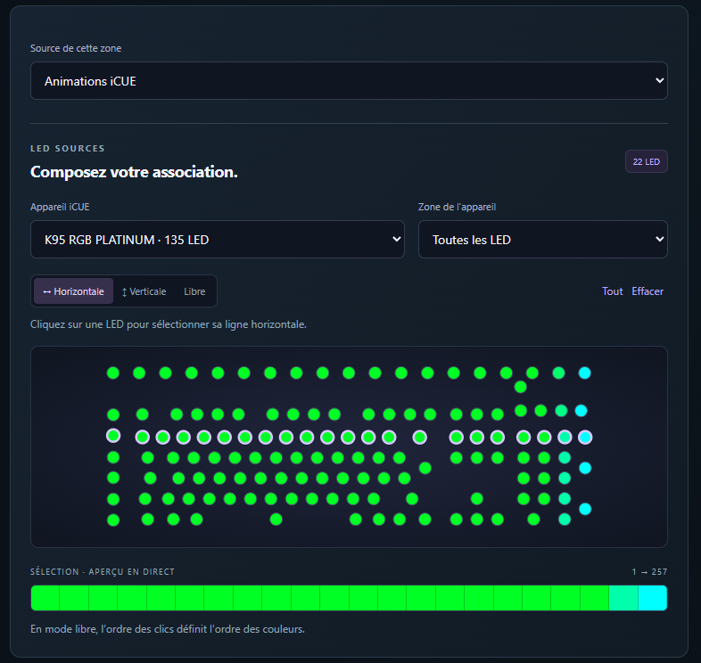</td>
</tr>
<tr>
<td width="50%">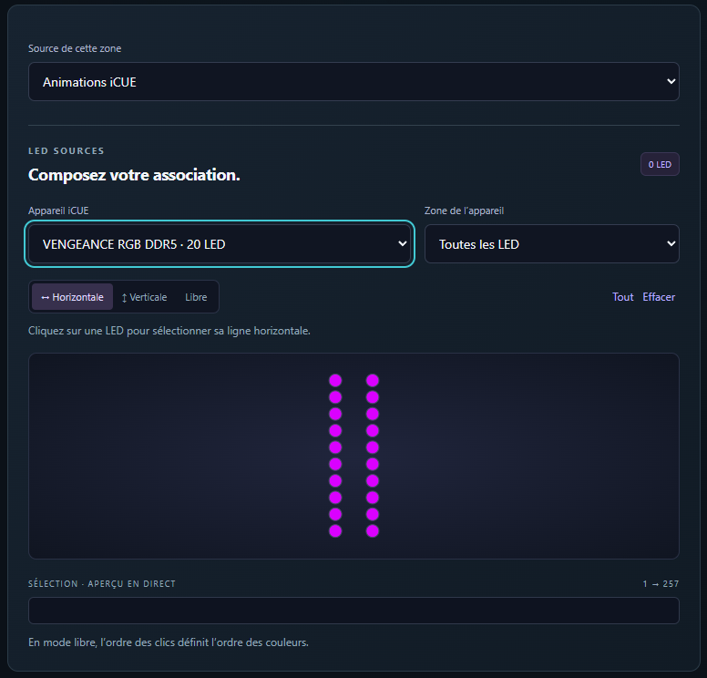</td>
<td width="50%">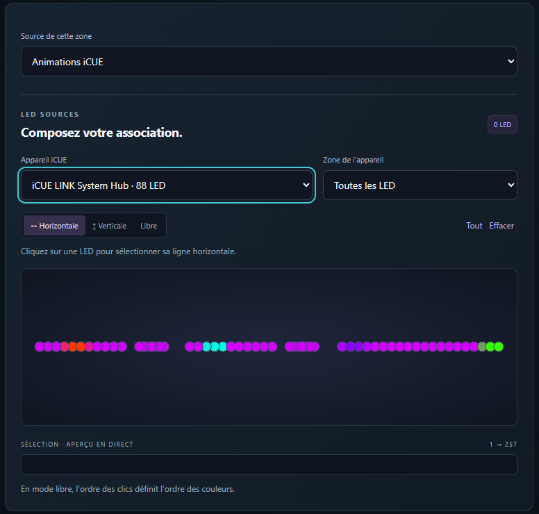</td>
</tr>
</table>

</div>

The interface is organized so that the important parts of a lighting setup remain visible and understandable: your devices, the source of the colors, presets and the relationship between the screen and the physical LEDs.

---

## 🧭 Screen → LED mapping

One of the central ideas behind Raptor Link is that a physical LED installation does not always match a simple rectangular strip.

A desk can contain several LED sections. A monitor can have LEDs only on some edges. A room can have several WLED controllers. Raptor Link lets you describe that installation and decide **which LEDs should react to which part of the screen**.

<div align="center">

<table>
<tr>
<td width="50%">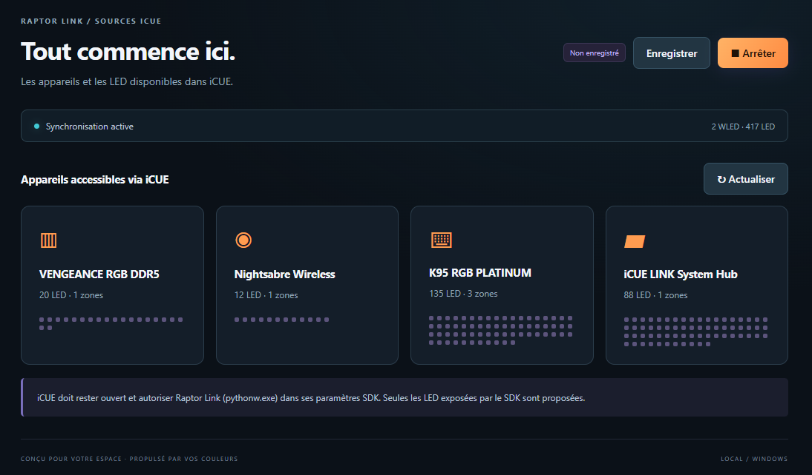</td>
<td width="50%"></td>
</tr>
</table>

</div>

This makes it possible to build Ambilight-style effects while keeping the mapping adapted to the real installation.

### Keyboard / LED addressing in action

<div align="center">

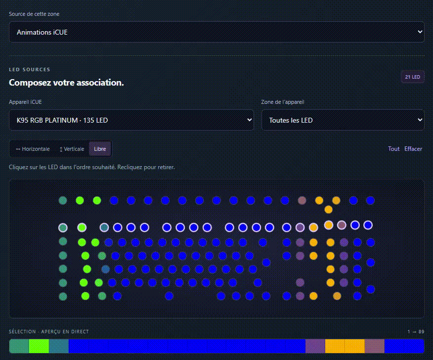

</div>

---

## 🎮 Built for iCUE users — useful without iCUE

The original goal of Raptor Link is simple:

**let DIY WLED lighting live alongside a Corsair iCUE setup instead of remaining isolated from it.**

That means Raptor Link is especially useful if your PC already uses Corsair RGB hardware and you also have custom LED strips, ESP32/ESP8266 controllers or decorative WLED lighting around the desk.

At the same time, the WLED side remains useful on its own. You can use Raptor Link without Corsair hardware when you only need screen ambience, presets or centralized WLED control.

---

## 🌈 Keep the power of WLED

Raptor Link does not try to replace WLED.

WLED remains responsible for the LED controller itself, its effects, segments and presets. Raptor Link sits above it and helps coordinate the installation from the PC.

That means you can keep using the WLED features you already know while adding PC-side control.

<div align="center">

<table>
<tr>
<td width="50%">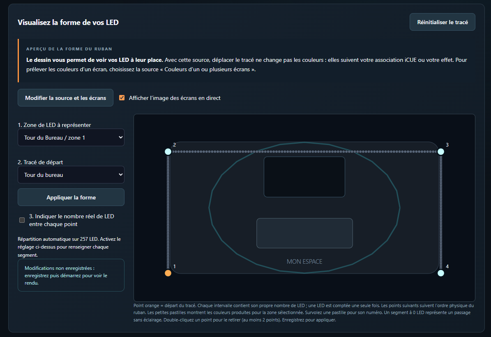</td>
<td width="50%">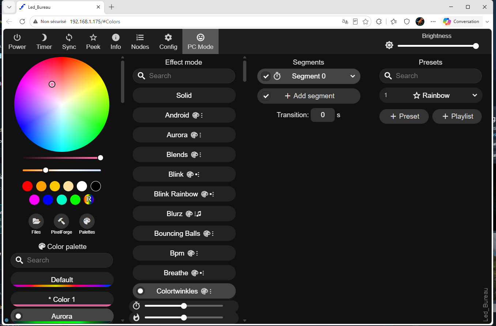</td>
</tr>
</table>

</div>

---

## 🚀 Quick start

1. Install and configure **WLED** on your LED controller.
2. Connect the PC and WLED device(s) to the same local network.
3. Download and install **Raptor Link** from the **Releases** section.
4. Add your WLED controller by IP address.
5. Configure the physical LED layout / mapping.
6. Choose how the LEDs should be driven:
   - screen colors,
   - WLED presets,
   - iCUE integration,
   - or another available Raptor Link mode.
7. Save the configuration and let Raptor Link run from the system tray.

> **iCUE is only required for the Corsair integration.**

---

## 📥 Download

Prebuilt Windows installers are published through **GitHub Releases**.

### [➡️ Download the latest release](https://github.com/Inter-Raptor/Raptor-Link/releases)

The recommended file name is:

```text
Raptor-Link-Setup-vX.Y.Z.exe
```

If no release is visible yet, the public installer has not been uploaded for that version.

---

## 🛠️ Requirements

- Windows 10 or Windows 11
- One or more devices running WLED
- PC and WLED devices reachable on the same network
- Corsair iCUE only when using the iCUE integration

Typical WLED hardware includes ESP32 and ESP8266 based controllers.

---

## 🧩 Typical setups

Raptor Link can fit several kinds of installations:

- RGB lighting behind one or more PC monitors
- LED strips around a desk
- WLED wall lighting synchronized with the PC
- DIY ESP32/ESP8266 LED projects
- mixed Corsair + WLED gaming setups
- decorative WLED lighting controlled from Windows
- screen-reactive ambient lighting

---

## 🖱️ Designed to stay out of the way

Raptor Link can remain accessible from the Windows system tray, so the application does not need to occupy your desktop permanently.

<div align="center">

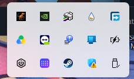

</div>

---

## 📸 More screenshots

<details>
<summary><b>Open the gallery</b></summary>

<br>

<div align="center">

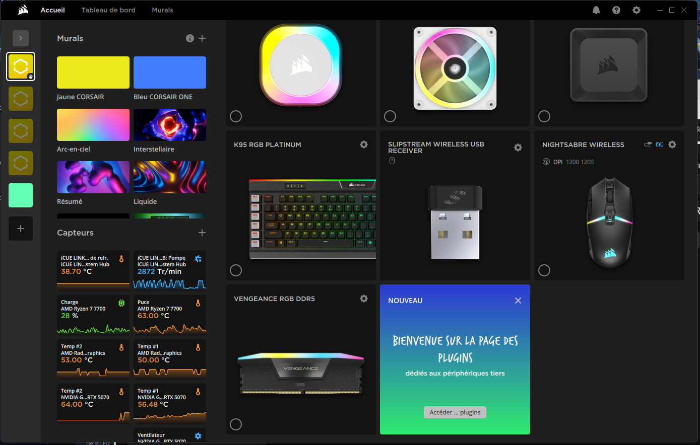

<br><br>

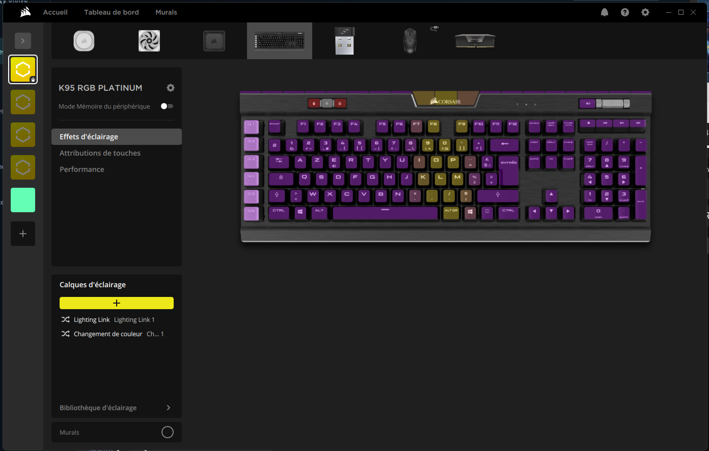

</div>

</details>

---

## 🗺️ Project direction

Raptor Link is an evolving community project. Current development focuses on making WLED/PC lighting integration easier to configure and more flexible.

Areas of interest include:

- richer iCUE synchronization
- improved device discovery
- more visual mapping tools
- additional preset and automation options
- improved diagnostics
- easier first-time setup
- additional language support

---

### Experimental RGB lab

Raptor Link's normal interface is intentionally centered on **Corsair iCUE** and Raptor Link's own direct sources such as screen sampling, audio reaction and local effects.

Unfinished vendor connectors — including MSI Mystic Light, OpenRGB and brand-specific experiments — are hidden by default. Advanced users can expose them from **Settings → Advanced → RGB lab**.

These connectors are experimental, limited and may require extra vendor software, SDKs or OpenRGB. They are kept in the project for hardware testing and future development, but they are not presented as part of the normal supported workflow.

## 💬 Built-in feedback & hardware testing

Raptor Link keeps an in-app feedback center for questions, bugs, suggestions, comments and ratings. Users can prepare questions, bug reports, suggestions, ratings and hardware compatibility reports without exposing a GitHub token inside the application. The final report opens on GitHub pre-filled so the user can review it before submitting.

### Startup stability

Raptor Link starts its realtime WLED stream independently from the WLED HTTP API. This avoids long startup delays when Windows, Wi-Fi, iCUE or a WLED controller become ready at different times. Health checks stay read-only, and temporary source interruptions keep the last valid frame instead of flashing black.

## 🐛 Bugs, ideas and feedback

Found a problem? Have an idea that would make Raptor Link better?

Use the GitHub issue templates:

- **Bug report** → something does not work as expected
- **Feature request** → suggest a new function or improvement

### [➡️ Open an issue](https://github.com/Inter-Raptor/Raptor-Link/issues)

When reporting a bug, include your Raptor Link version, Windows version, WLED version and screenshots/logs when useful.

---

## 🤝 Contributing

Raptor Link is intended to be open, reusable and improvable.

Contributions can include:

- code
- documentation
- testing
- translations
- hardware compatibility reports
- UI ideas
- bug reports

See **[CONTRIBUTING.md](CONTRIBUTING.md)** for the contribution guidelines.

---

## 🔐 Security & privacy

Raptor Link communicates with WLED devices on the local network.

Do not publish passwords, Wi-Fi credentials, API keys or private tokens in public issues or screenshots.

See **[SECURITY.md](SECURITY.md)**.

---

## 📜 License

Raptor Link is released under the **MIT License**.

You are free to use, modify, study, redistribute and build on the project under the terms of the license.

See **[LICENSE](LICENSE)**.

---

## ❤️ Credits

Raptor Link exists thanks to the ecosystem around:

- **[WLED](https://github.com/Aircoookie/WLED)** — open-source LED control firmware
- **[Corsair iCUE](https://www.corsair.com/icue)** — Corsair RGB ecosystem

Raptor Link is an independent community project and is **not affiliated with, endorsed by or sponsored by Corsair or the WLED project**.

---

<div align="center">

### 🦖 Raptor Link

**DIY lighting. PC control. One ecosystem.**

If the project is useful to you, consider giving the repository a ⭐ — it helps other WLED and iCUE users discover it.

</div>
